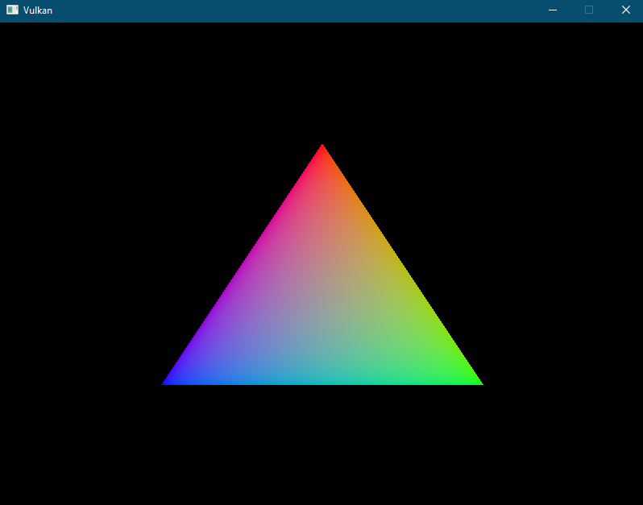

# Vulkan Renderer (Work in Progress)

This repository contains a work-in-progress Vulkan renderer implemented in C++, following the excellent "Learn Vulkan" tutorial at [vulkan-tutorial.com](https://vulkan-tutorial.com). The primary purpose of this project is to facilitate personal learning and experimentation with Vulkan graphics programming.

## Example

The image above is the first output produced by the program.